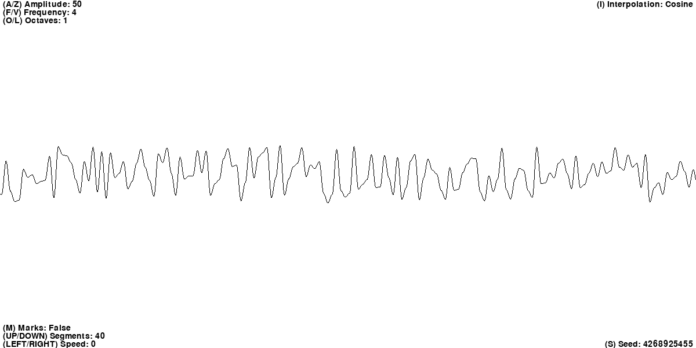
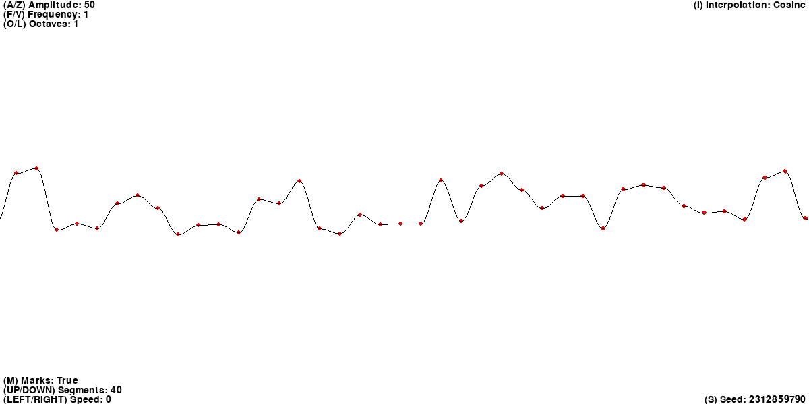
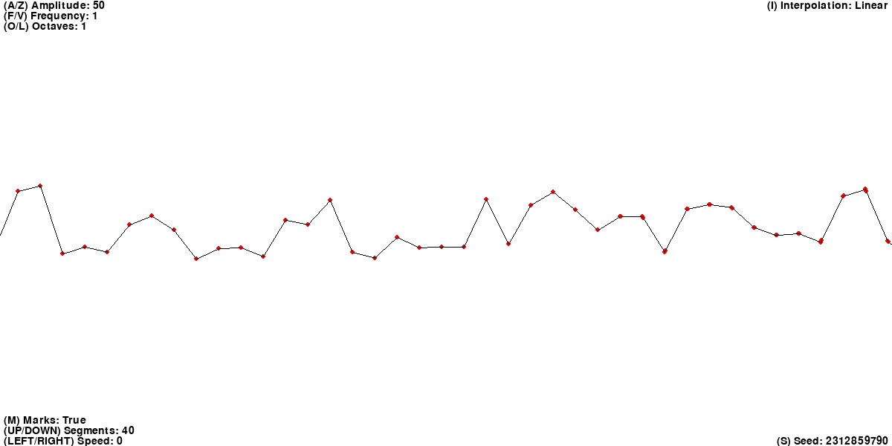

# One-dimensional Perlin noise
This is implementation of one-dimensional [Perlin noise](https://en.wikipedia.org/wiki/Perlin_noise) algorithm and also its interactive demo.

## Stack
- Python3
- [Pygame](https://www.pygame.org/news) (For demo)

## Supported interpolation types
- [Linear interpolation](https://en.wikipedia.org/wiki/Linear_interpolation)
- [Cosine interpolation](https://en.wikipedia.org/wiki/Trigonometric_interpolation)
- [Cubic interpolation](https://en.wikipedia.org/wiki/Cubic_Hermite_spline)

## Setup
Clone the repository and change the working directory:

    git clone https://github.com/alexandr-gnrk/perlin-1d.git
    cd perlin-1d
Create and activate the virtual environment:

    python3 -m venv ./venv
    source ./venv/bin/activate
Install requirements:

    pip3 install -r requirements.txt
Run the demo:

    python3 main.py

## PerlinNoise class usage
Simple case: 

    >>> from perlin_noise import PerlinNoise, Interp
    >>> 
    >>> seed = 10
    >>> noise = PerlinNoise(seed)
    >>> noise.get(0)
    -0.7909696871365708
    >>> noise.get(1)
    -0.12853800531350212
    >>> noise.get(0.24)
    -0.7011998031545463
    >>> noise.get(0.3)
    -0.6544376328384862
    >>> noise.get(5)
    0.8343996279794508
 
With specified **interpolation**:
 
    >>> noise = PerlinNoise(seed, interp=Interp.LINEAR)
    >>> noise.get(0)
    -0.7909696871365708
    >>> noise.get(1)
    -0.12853800531350212
    >>> noise.get(0.5)
    -0.45975384622503646
    
With specified **amplitude**, **frequency**, **number of octaves** and **interpolation type**:

    >>> noise = PerlinNoise(seed, 2, 10, 3, interp=Interp.CUBIC)
    >>> noise.get(0.1)
    0.12735558147138537
    >>> noise.get(0.2)
    0.7056095270509709
    >>> noise.get(0.3)
    -0.4716026010196055

## Demo control

Keys | Action
------------ | -------------
A/Z | Increase/decrease amplitude
F/V | Increase/decrease frequency
O/L | Increase/decrease number of octaves
UP/DOWN | Increase/decrease number of segments on screen (implicit frequency)
LEFT/RIGHT | Change speed of moving noise
M | Turn on/off marks
I | Change interpolation method
S | Reseed noise
Space | Set speed of moving to 0

## Demo screenshots
### Simple 1D Perlin Noise:

### Noise with a high amplitude:

### Noise with a high frequence:

### Noise with 4 octaves:

### Noise with marks on it:

### Noise with linear interpolation:

### Noise with cubic interpolation:

## Useful links
1. [Perlin Noise](https://web.archive.org/web/20160530124230/http://freespace.virgin.net/hugo.elias/models/m_perlin.htm)
2. [1D Perlin noise](https://codepen.io/OliverBalfour/post/procedural-generation-part-1-1d-perlin-noise)
3. [Interpolation methods](http://paulbourke.net/miscellaneous/interpolation/)
